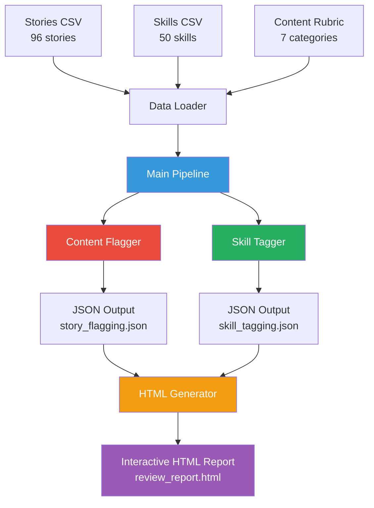
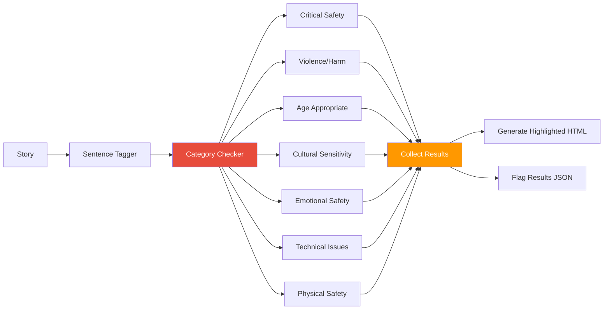
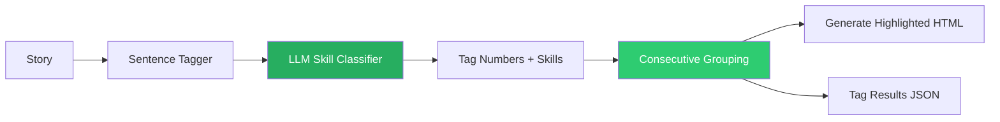
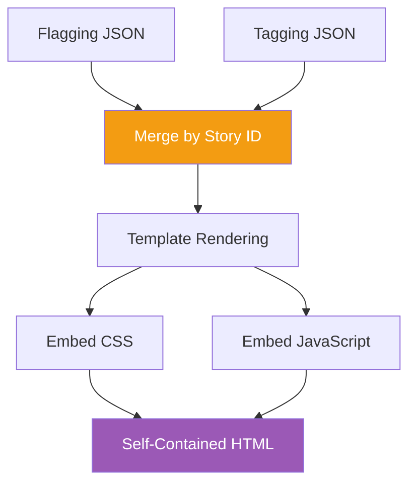
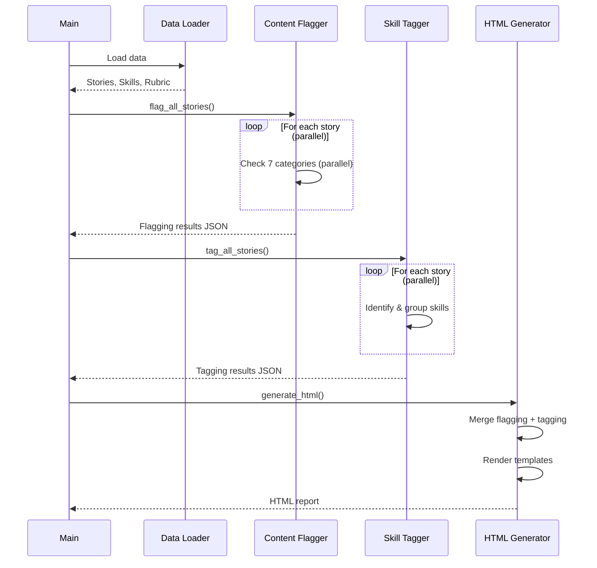

## **Overview**

This system provides an automated content-review pipeline for children’s stories. It flags potentially problematic content using a rubric of seven categories and tags reading skills using a 50-skill taxonomy. The design emphasizes accuracy, transparency, and fast parallel processing, enabling content specialists to efficiently validate AI-generated suggestions in a unified HTML review interface.

At the core of the system is an LLM-driven strategy that relies on **GPT-4o-mini** for classification, rubric-based content checks, and sentence-level skill tagging. The model is chosen for its speed, structured JSON outputs, and reliable reasoning, with the flexibility to upgrade models without altering the architecture.

---

## **System Architecture**

### **Integrated LLM Design Choices**

* **Model:** GPT-4o-mini for low-latency classification and reliable JSON responses.
* **Flagging Approach:** Fully LLM-based per category (no regex/rule systems), allowing nuanced contextual judgment.
* **Skill Tagging:** Single-pass classification across all 50 skills.
* **Sentence Strategy:** Stories are pre-tagged with XML markers (`<tag1>...</tag1>`) so the LLM references sentence IDs instead of generating text.
* **Parallelism:** Two-level parallel processing enables rapid review of all 96 stories across 7 categories.
* **Post-processing:** Consecutive sentence grouping reduces redundancy and enhances readability.

---

## **Core Components**

---

## **1. Data Loader**

**Responsibilities**

* Loads stories, 50-skill taxonomy, and 7-category rubric.
* Applies sentence tagging:
  `<tag1>Sentence.</tag1> <tag2>Sentence.</tag2>`
* Produces clean, token-efficient input for the LLM.

**LLM Integration**

* XML sentence IDs allow the LLM to reference sentences precisely without text generation.
* Reduces hallucination risk and simplifies HTML highlighting.

---

## **2. Content Flagger**

Identifies issues across all seven rubric categories using an LLM approach prompt per category for each story, executed in parallel.

**LLM Behavior**

* Each category uses a targeted rubric-focused prompt.
* Handles contextual nuance (e.g., historical violence vs. gratuitous).
* Supports multiple flags per sentence.
* Maintains highest severity across overlaps.

**Performance**

* Story-level and category-level concurrency enables ~5-minute full-dataset processing.

---

## **3. Skill Tagger**

Performs a single LLM pass per story to classify all relevant reading skills from the 50-skill taxonomy.

### **LLM Strategy**

* The LLM reads the full taxonomy and returns:

  * skill names
  * confidence scores
  * sentence tag references
* Eliminates multiple passes, ensuring coherent global interpretation of a story.

### **Consecutive Sentence Grouping**

* Adjacent tagged sentences are merged:

  * Example: `[1,2,3]` → one evidence block
* Reduces JSON size and creates clearer reviewer evidence.

### **Category-Based Highlighting**

* Decoding = Blue
* Comprehension = Green
* Vocabulary = Red
* Knowledge = Orange
* Fluency = Purple

---

## **4. HTML Generator**

Produces a single-page interactive review tool combining flagging and skill tagging results.

**Features**

* Dropdown story selector
* Tabs: *Flagging* / *Tagging*
* Auto-calculated critical badge
* Editable fields (severity, skill, category, confidence)
* Read-only evidence/rationale
* Accept/Reject workflow
* Contextual highlighting tied to sentence tags

---

## **Complete Pipeline Workflow**

