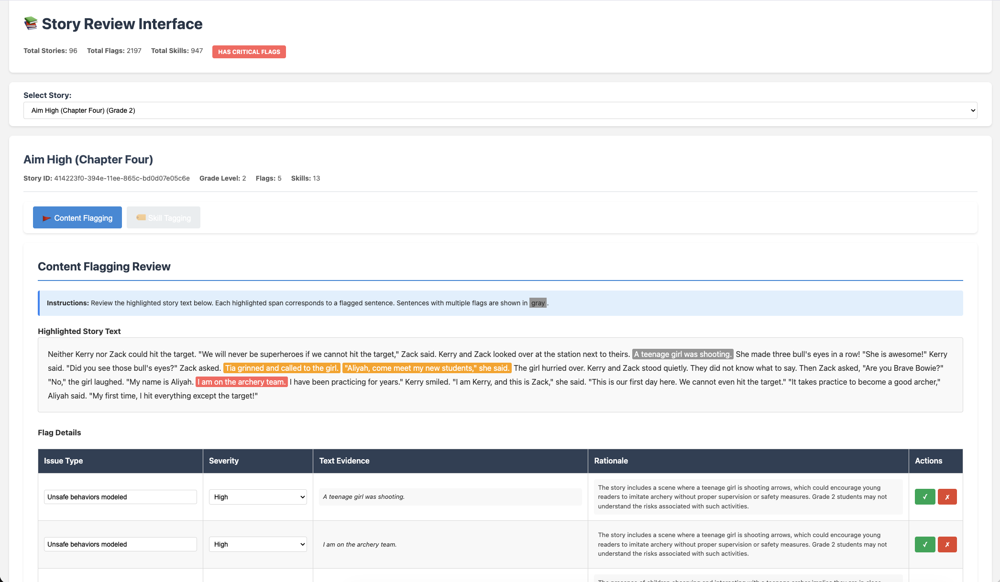

## How to run the submission

### Setup

#### Prerequisites

- Python 3.9 or higher
- API key from OpenAI

#### Installation

1. **Navigate to the project directory**

2. **Create a virtual environment**:
   ```bash
   python -m venv venv
   source venv/bin/activate  # On Windows: venv\Scripts\activate
   ```

3. **Install dependencies**:
   ```bash
   pip install -r requirements.txt
   ```

### Usage

##### Step 1: Activate Virtual Environment

```bash
source venv/bin/activate  # On Windows: venv\Scripts\activate
```

##### Step 2: Set API Key

```bash
# Set the API key for current session
export OPENAI_API_KEY=your-api-key-here
```

##### Step 3: Run the Pipeline

Execute the main script to process all 96 stories:

```bash
python main.py
```

The pipeline will:
1. **Load data** - Stories, skills taxonomy, and content rubric
2. **STEP 1: Content Flagging** - Check all stories for problematic content
3. **STEP 2: Skill Tagging** - Tag stories with reading skills
4. **STEP 3: HTML Generation** - Create semi-interactive review report

Processing time: Approximately 5-10 minutes for all 96 stories with `gpt-4o-mini`.

##### Step 4: Access the Output

**Option A: View HTML Report (Recommended)**

Open the interactive HTML report in your browser:

```bash
# On macOS
open output/human_review/review_report.html

# On Windows
start output/human_review/review_report.html
```

The HTML report provides:
- Story selector dropdown (navigate between 96 stories)
- Tab-based interface (Content Flagging / Skill Tagging)
- Color-coded highlighting of flagged content and tagged skills
- Interactive tables with editable fields
- Summary statistics and critical flag badges

**Option B: Access Machine-Readable JSON**

View the JSON output files:

```bash
# Content flagging results
cat output/machine_readable/story_flagging.json

# Skill tagging results
cat output/machine_readable/skill_tagging.json
```

#### Individual Module Usage

If you need to process individual stories or integrate specific components:

```python
from src.utils.data_loader import DataLoader
from src.utils.llm_client import LLMClient
from src.flagging.content_flagger import ContentFlagger
from src.tagging.skill_tagger import SkillTagger

# Initialize
data_loader = DataLoader()
llm_client = LLMClient()

# Flag a single story
flagger = ContentFlagger(data_loader, llm_client)
result = flagger.flag_story("story_001")

# Tag a single story
tagger = SkillTagger(data_loader, llm_client)
result = tagger.tag_story("story_001")
```

### Project Structure

```
repo/
├── data/                      # Input data
│   ├── stories.csv           # Children's stories dataset
│   ├── content_rubric.md     # Content review guidelines
│   └── skills.csv            # Reading skills taxonomy
├── src/                       # Source code
│   ├── flagging/             # Content flagging module
│   ├── tagging/              # Skill tagging module
│   ├── report/               # Report generation
│   └── utils/                # Utilities and helpers
├── output/                    # Generated outputs
│   ├── human_review/         # HTML reports
│   └── machine_readable/     # JSON/CSV files
├── tests/                     # Unit and integration tests
├── main.py                    # Main entry point
├── requirements.txt           # Python dependencies
├── DESIGN.md                  # Design decisions document
└── FEEDBACK_PROPOSAL.md       # Feedback mechanism proposal
```

## Screenshot of the UI

